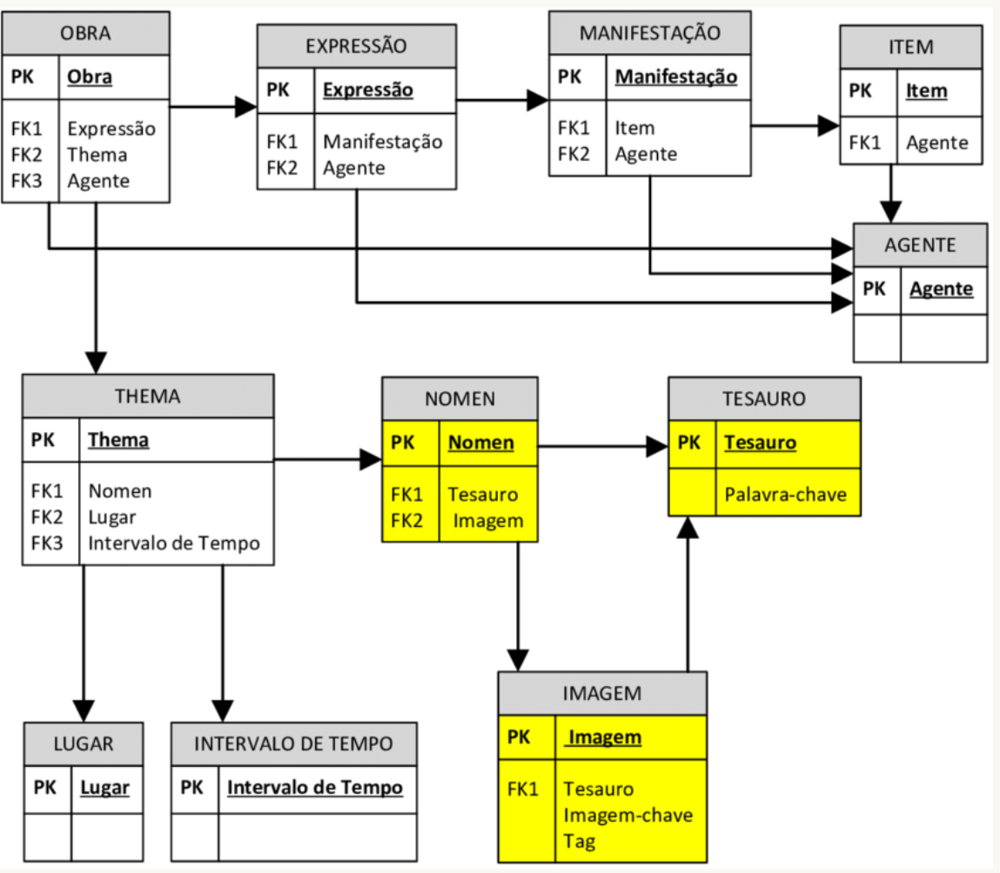
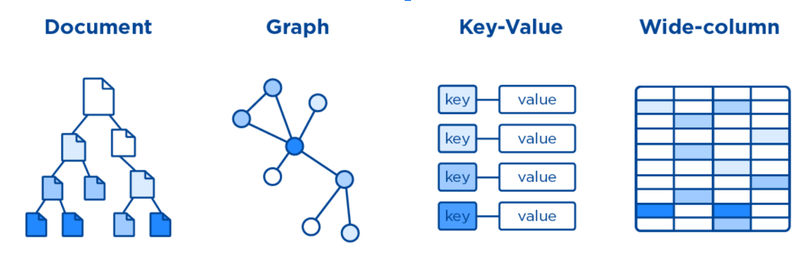

# NoSQL/Firebase

## Índice

* [Introdução](#introdução)
* [BaaS](#baas)
* [Firebase](#firebase)
* [LAB](#lab)

## Introdução

### NoSQL (Not Only SQL)

* É usado em sistemas que utilizam um grande número de armazenamento e pesquisa de dados.

* Funciona de forma totalmente diferente dos bancos relacionais.

### Quais as diferenças para o modelo relacional ?

#### Modelo relacional

São fortemente baseados em Schemas;

É preciso primeiramente projetar uma estrutura (tabelas, campos e relacionamentos), para depois realizar a adição de dados;

#### Modelo não relacional

Não é necessário a definição de Schemas;

#### Algumas dificuldades no modelo relacional

É preciso saber exatamente todos os campos que serão utilizados em um conjunto de dados. No início de uma aplicação nem sempre se tem essa informação desde o início do projeto.

O desenvolvimento muitas vezes neste modelo tende a ser mais lento devido às alterações no banco de dados.

#### Tipos de NoSQL

##### Modelo colunas

Apesar de serem parecidos com o modelo relacional, o NoSQL do tipo colunas não trabalha com tabelas na sua estrutura. Aqui, as informações possuem suas colunas próprias, que podem ser agrupadas em uma mesma família — mas esse agrupamento não é um item obrigatório.

A grande vantagem do modelo colunas é proporcionar o gerenciamento de grandes volumes de dados com simplicidade e, principalmente, velocidade. Para aplicações de Big Data, por exemplo, essa característica é fundamental.

##### Modelo grafos

Como o nome esclarece, o modelo grafo tem como característica o armazenamento em nós conectados por arestas — e com propriedades únicas. Isso proporciona mais velocidade em pesquisas complexas, onde é necessária uma baixa latência para recuperar as informações.

Os bancos de dados baseados em grafos têm ganhado popularidade nos últimos anos, mas a sua curva de aprendizado ainda impede que mais empresas o utilizem em nível de produção.

##### Modelo chave valor

O modelo chave-valor é um dos tipos mais populares de NoSQL, justamente pela facilidade de gerenciamento e flexibilidade na operação. Para isso, seu funcionamento é simples: os dados são registrados em uma chave que, por sua vez, guardam algum valor.

Assim, para consultar os dados só é necessário saber qual é a chave também tratada como propriedade para recuperar o valor associado, que pode ter vários formatos.

##### Modelo documento

NoSQL do tipo documento cuja principal característica é a flexibilidade no armazenamento dos dados. Nesse modelo não é necessário ter qualquer estrutura pré-definida, já que essas são estabelecidas conforme a necessidade da aplicação.

Inclusive, o modelo de documento pode contar com agrupamentos de documentos. Ou seja, é possível aninhar informações de formatos diferentes sem qualquer tipo de burocracia ou dificuldade.

Então, é possível trabalhar com documentos únicos, ou mesmo um conjunto de documentos, conforme a aplicação necessitar

## BaaS

* Backend as a Service;
* Permite focar no Frontend;
* Utilizado como serviço;
* Customizável;
* Seguro;
* Infraestrutura Completa;

## Firebase

### O que é o Firebase ?

* Um Baas;
* Mantido pela Google;
* Disponível apenas Online;
* Apenas como serviço;
* Um BaaS com muitos recursos;

### Fornece

* Autenticação;
* Real Time database;
* Storage;
* Notifications;
* Hosting;

E muito mais ....

### Diferença entre GCP e Firebase ?

* GCP possui um conjunto muito amplo de serviços cloud
* Firebase foi pensado para aplicações mobile sem precisar ter uma implementação de backend
* O Firebase foi comprado pela Google e hoje roda em cima dos serviços da GCP.

### Prós

* Economia de tempo;
* Isenção de responsabilidades;
* Redução de Custos;
* Alta disponibilidade;

### Contras

* Customizável mais nem tanto;
* Você se adequa a ele;
* Dificuldades em cenário on Premises;

## LAB

Prática no [console]https://console.firebase.google.com) do firebase.